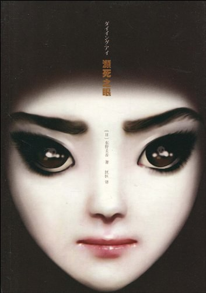

## 前言

这本书已经数不清楚是我看东野圭吾的第几本书了，自从高中看了《白夜行》之后，就再也无法忘记东野圭吾，兴许也就是在那时候对悬疑类感兴趣的。《濒死之眼》是我在Kindle上看的，开始看的时候是在暑假之前就有看了，但是暑假期间一直在忙别的事情，也就没有再继续读，暑假之后某一个周末想起那落灰已久的Kindle，就在图书馆将下半部分读完了。

东野圭吾的书于我而言有一种独特的吸引力，不想其余的书一般。只要一开始看就不想放下，直至看完，才猛然警觉。啊，看完了。但大部分的书，都是当做小说来看待，也并未专门仔细的去探究书中的某些细节，仅仅作为暂时逃离这纷扰世界的一个工具罢了，同时也算在追寻读完后的刺激感。

之前看的书，并没有做什么详细记录，因此许多书即使第二次再看的时候，也不知道自己曾经是否看过，非得阅读内容，大概了解主题之后，才会想起自己原来之前就看过这本书。觉得这样并不是很好，于是打算开始养成写读后感的习惯，也并不知道应该如何去写读后感，慢慢尝试吧。

## 图书简介

> 作者:  [[日\] 东野圭吾](https://book.douban.com/author/4537266/)
> 出版社: 上海译文出版社
> 原作名: ダイイング・アイ
> 译者:  [匡匡](https://book.douban.com/author/157003/)
> 出版年: 2010-4
> 页数: 244
> 定价: 22.00元
> 装帧: 平装
> 丛书: [东野圭吾作品](https://book.douban.com/series/12196)
> ISBN: 9787532750061

## 内容简介

> 一次意外的车祸使雨村慎介失去了许多之前的回忆。但是，为了查询车祸的起因，雨村开始了细致的调查。随着调查的深入，失去的回忆似乎一点点苏醒，而众多玄妙的事件也随之一件件发生。谎言与真相都徘徊在死亡的边缘。幕后的神秘人物到底是谁？面对死亡，是该睁大眼睛还是紧紧地闭上？

## 作者简介

> 东野圭吾，1958年生于日本大阪，大阪府立大学工学部电气工学科毕业。1985年以处女作《放学后》获得第31届江户川乱步奖，即辞职专心写作。1999年以《秘密》一书获得第52届日本推理作家协会奖，2006年又以《嫌疑犯x的献身》荣获第134届直木奖，成为史上第一位囊括日本文坛三大奖的推理作家。早期作品以校园青春推理为主，擅写缜密精巧的谜团，获得“写实派本格”的美名。后期则逐渐突破典型本格，而能深入探讨人心与社会议题，兼具娱乐、思考与文学价值。其惊人的创作质量与多元化的风格，使得成为日本推理小说界超人气的顶尖作家。代表作：《十一字杀人》、《绑架游戏》、《白夜行》、《信》、《侦探伽利略》等，多部作品已被改拍成电视剧或电影。

## 短评

> ### [吃饱饱的贼贼](https://www.douban.com/people/zaysoso/)  2012-11-19
>
> 昨天本来9点多就准备睡觉，想了想最近下载了好多书，就看看睡前读物吧。看了30%的时候就完全被吸引，然后到11点半看完了。看推理悬疑小说的时候很喜欢跟着一起推理，但是这本被作者唬的团团转，到了最后才懂其中因果。我觉得是挺精彩的一部，超越了嫌疑犯X的献身。不过副作用是不敢睡觉了。。。

> ### [螃蟹蟹](https://www.douban.com/people/duomeyouai/)  2014-01-21
>
> 居然是个鬼故事 逻辑好烂

> ### [宅蘑菇Moku](https://www.douban.com/people/eowynlost18/)  2016-06-13
>
> 咦怎么这本都变成灵异神棍小说了…要说悬疑么还是有的，就是那个女子干嘛要莫名其妙找仇家啪啪啪啊简直不明就里= =整个故事怪怪的

## 热评

> [helency](https://www.douban.com/people/pontiacy/)  2010-05-14 16:25:47
>
> [多自责才是够自责](https://book.douban.com/review/3268546/)
>
> 这篇书评可能有关键情节透露
>
> 这本书我本来想给两星的，是我看过的东野的书里我要打最低分的。不喜欢的原因是觉得几次性爱的露骨描写挺没必要的。我并不是卫道士，连《色戒》的尺度都可以接受，不过我觉得这本书里，它们的意义不足，起码没交代清楚。而且觉得，写书要看受众。东野的书很通俗吸引人，想必很多青少年也喜欢看，可是这本书却太过于没必要的少儿不宜了。
>
> 但是还是给了三星，原因是这个题材我还挺喜欢的，也思考过这方面的问题——**当别人因你而受伤害、甚至失去生命的时候，你有多自责才是够自责？才对得起受害者以及他的家人朋友？**
>
> ……
>
> 总之，当一个人夺去另一个人生命的时候，怎么才算公平呢？一命抵一命呢？还是如果你非恶意，就可以不被惩罚、或者只被小小地惩罚呢？我想我们每个人会有不同的尺度，而且在我们所处的身份不同时，更会有不同的答案。我的答案是，无论如何人都要有充分的同情心（或者说，也许英语empathy这个词更确切，就是要体会对方的心情）吧，活着的人还是往前看好好活，也许死了的人才会更安心。**而东野看来是个理想化的极端的人。他决定让车祸的肇事者被灵魂附体，永世不得安宁。**

> [[黑暗之刺](https://www.douban.com/people/10258808/)  2010-05-27 16:30:52
>
> [人性鸡尾酒](https://book.douban.com/review/3297318/)
>
> 这本书我给４星，估计很多人想不通，事实上这本书从结构到内容，最多３星而已．多给的一星是送给由单线推理扩展出去的那份新意．国内目前所出的东野圭吾作品无论新旧，多以推理为主，尽管本书也是以推理作品为名上架，事实上推理成分很弱，有点类似灵异小说或恐怖小说，通俗易读．对于个人的阅读感受而言，换个体验也未尝不好．
>
> 一起车祸的发生，一起酒吧袭击案，两个看似没关联的事，却让调酒师雨村慎介深陷困境，被袭击以后的他失去了部分记忆．为了追寻失去的记忆，他不得不四处打听．同居女友，老板，同事，熟客，虽然失去记忆很痛苦，但是不等同于失去智商，他发现每个人都对他有所隐瞒，劝他不要再回忆不愉快的往事．同时一个神秘的女子出现在他工作的酒吧，对他产生极大的诱惑．往事与现状的纠结让他越是挣扎便陷的越深，杀机则随着他记忆的恢复也迎面扑来．
>
> 事实上这故事的结构真的算是精致，由一桩意外的车祸引出随后的袭击案，再由袭击案牵出敲诈案，更由敲诈案演变为杀人案，为解惑而展开的平民侦探之旅，人与人之间的隐瞒与欺骗，暴力袭击与温柔一刀相映成趣，环环相扣的推理过程还算严谨，算是印证了东野既会推理又会说故事的能力吧．或许本作属于夹在早期与成熟期之间的缘故，故事里巧妙的嵌入人性的纠结，意外与计划，自责与报复，顶替与勒索，每一段纠结都在确认故事发展下去的必要性．而所谓濒死之眼的无言惩罚更是让故事带有黑色幽默的味道，娱乐性与思考性混搭的手法还是值得肯定的．
>
> 至于里面的情色描写与超自然的鬼魅描写，谈不上有趣，却也保留得当．日系小说里如果没有情色描写，那真是异数，本作里的情色描写事实上与情节发展是密不可分的，绿出现酒吧的刻意勾引，得到以后再铲除的变态心理；超自然部分的描写也多少提升了小说的阅读乐趣，尤其是濒死之眼那强大的超自然力量．说实话当我看到这部分描写，还以为东野是在写宿世轮回般的鬼故事，不由的联想到那本获得第52届日本推理作家协会奖的＜秘密＞．当然，你非当成推理小说来看，那这部分描写多少会让你心生不快，不过我到是觉得，在初夏微热的环境里，体验阅读带来的微微寒意，也算是种享受吧．
>
> 东野创作的分割线是很明显的，早期作品的为推理而推理，当下作品的为世故而世故．而本书则可以算是骑墙之作．**将推理的严谨配合俗世人情，再加点诡异的灵异描写，多元化的话题探讨，调成一杯既可以畅饮又可以细品的人性鸡尾酒，看似色彩斑斓，个中滋味只有阅者自知**．而作为创作快枪手，东野一贯简练的文字可以让读者快速上手，精致的结构在阅读完以后又略可回味，对于流行小说而言，算是中规中矩．不足之处就是全书几无真情实爱，不太和谐：）情感冲突大多是围绕欺骗与谴责在发展，人性变化如此激烈，还是拍成电视剧会比较好看吧．总之，好看与否只在个人感受．

[更多热评请点击此处](https://book.douban.com/subject/4286244/reviews)

## 感悟

我的感悟其实也没有什么，相对于上面的读者来说，我更多的是把这本书当成一个休闲读物。

其实我也并没有深入的去研究文笔还是文章的架构，兴许是我自身的文笔也一般吧，但我仍然觉得这本书写得还是很到位的。虽然标签是悬疑，但实际上悬疑的成分并不多，如果不说这是东野圭吾先生的书的话，想必跟悬疑应该扯不上太大关系。兴许东野圭吾先生是想尝试一下`恐怖类`的主题才有的这篇文章，在`恐怖主题上`部分，不能说很优秀，但的确也让我吓得不轻。读完之后，整个人的感觉就不是很好，并非像他的其他小说一般让人惊叹，反而是有一种沉闷的气息。读后仔细思量，却也可以体会到作者的用心。也正是因为如此，我才觉得这本书写得还是成功的吧。

题材的选取对于一本书来说至关重要，对于东野圭吾先生这样的靠悬疑出名的作家来说，我觉得他更多的可能是想通过这本书来传递他对于该种题材的看法。就像前面某位热评者的看法一样，该书题材为：**当别人因你而受伤害、甚至失去生命的时候，你有多自责才是够自责？才对得起受害者以及他的家人朋友？**而东野圭吾先生通过该本书传递的情感，则比较极端化：**他决定让车祸的肇事者被灵魂附体，永世不得安宁。**

对于一本书的好坏，都在于个人的看法，个人的出发点不同，当然审判的角度也就自然不同。我的看法下，我认为东野圭吾先生可能只是想尝试议案`恐怖类`的主题，而在这一点上，我觉得他是成功的。这本书读完，给我也有些许感悟。无论是**雨村慎介**执意追求事情的真相，还是**村上成美**半路上的背叛，亦或是**木内春彦**对**岸中美菜绘**的爱意（当然也可以认为是为了金钱），都是值得让人深思的。

虽然书中的确有些让人不是很能理解的情节，但整体上，还是很支持东野圭吾先生的。

读于2019年9月14日 20时48分

写于2019年9月16日 19时52分

