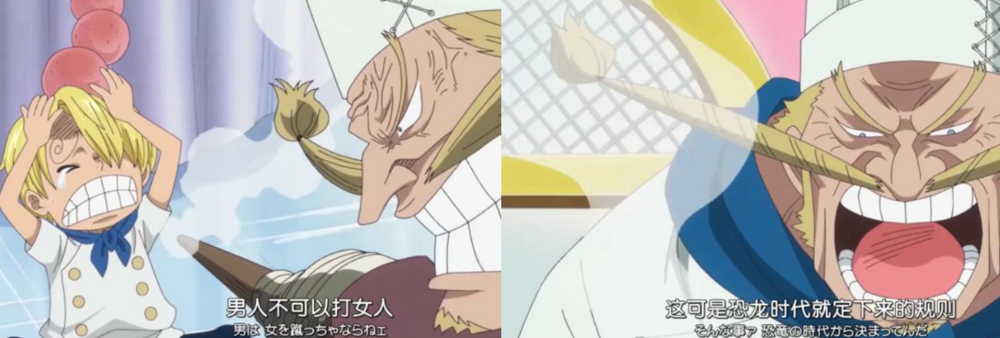
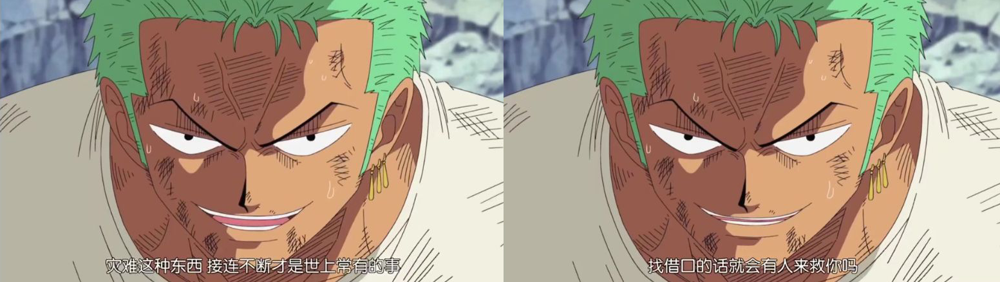

# 来人间一趟，要看看太阳

很久没有写点东西了。随便写点。

上周日，海贼王动画到了1000集。动画组很贴心的将当初第一集的经典片头曲《We are》当成了第1000集的片头曲。有趣的是，第1000集片头曲伴随的内容，与第一集完全重叠，但所有的人物都变成了现在的模样，无一不在致敬过往。

海贼王，早已记不清是何时开始看的，只记得小时候在家里吃饭时，总爱端着饭看着星空卫视的海贼王，还经常会被家里人训斥。当初的我肯定没有想到，不经意间看的一部动画片，居然让我追了十几年吧。作为一部热血动漫，它也的确给足了热血。很庆幸的是，它的三观足够正，以至于长久以来，让我潜移默化地被影响到。

从小会很喜欢山治的骑士道精神：**男人不可以打女人，这可是在恐龙时代就定下来的规则。**

后来发现索隆真的如他所说，再也没有输过，就有把他的精神用在鼓励自己上：

在后来遇到困难时，也会时常被里面的话激励到：

> 我如果这样就死了，就说明我只是这样程度的人而已！

> 听着，路飞，胜利和败北都要品尝，经历了四处逃窜的辛酸，痛苦伤心的回忆，男人才能真正独当一面，就算痛哭流涕也没关系，一定要闯过这一关！

很难不去肯定这部动漫带给我的影响，所幸，目前看来，是正面且积极的影响。

---

> 生活葬了童真，物欲脏了灵魂。

记得中学时代的我，向来充满着“少年气息”，只是彼时的少年，更像是“初生牛犊不怕虎”一般的执拗与莽撞，对人对事向来只追求自己开心即可，并且还理直气壮地说道“懂我的人，不用解释，不懂的人，何必解释”。而且对“喜欢我的人总会留下来”这种观点深信不疑，因此对身边的人十分放肆。也正因如此，在这趟前行的列车上，有人提前下车了，我也毫不稀罕。上了大学，如果脱缰的野马，更加肆无忌惮。愤世嫉俗的心理，对各种不平之事向来都是无所畏惧。学长学姐，导师导员，无一不被自己怼过。当然，也都是有正当缘由的，毕竟自己也并非是那不讲理之人。只是更像是抓住把柄便丝毫不留情面一般，让人虽然知错，但也心生不满。

好在，当时的自己有着广泛的兴趣爱好，在别人因为繁重的课程而抱怨连天之时，自己还能学习各种不搭边的技能。也正是因为这些技能，导致身边的人对我是又爱又恨。当时的自己虽然认识到自身欠缺的地方有很多，但更加注重的是实用技能，因此学习了象棋，写作，设计，剪辑，新媒体，前端等各项技能。那时的我，真可谓是不识天高地厚，放眼处皆自负才高八斗。后来遇到了一个人，在日常交流中发现总会存在“词不达意”的情况，便有逐渐怀疑自己的表达能力，随后便发现自己的为人处事方面的社交能力简直是一塌糊涂。这时再回头看，发现之前即使被我“百般虐待”却能留在我身边的人，是那么的美好。从我之前写的大学生活一文中也能看出，在大三之后，和大一大二那般的成就便少了许多，只因在反思自己，更多的是在学习如何与人相处。

兴许是当时遇到的人不对，让那时的我倍感困扰，感觉自己无论做什么，说什么都是错的。费尽心思想尽一切办法也毫无起色，真的有够怀疑人生的。而那时，也正好遭遇了一些很难不让人被感受到伤害的事情。众多亲人朋友的离去，让自己愈发不知所措，对身边人也从毫不在乎变成了倍感珍惜，毕竟真的不知道什么时候就是永别。现在看来，也许是从那之后，开始养成了小心翼翼的习惯。对人对事不再张扬跋扈，反而事事替对方考虑，生怕因为自己的行为给他人带来困扰，对自己的要求也格外苛刻起来。纵然后来意识到有些过度，也尝试着调整。但也只能做到对于一般人的离去不在于，而对于真的想要留在自己生命里的人，就会表现出格外激烈的情感，以至于让对方喘不过气。当察觉到不对的情绪，又会表现出小心翼翼的状态。无论是语言还是行为，都将卑微体现得淋漓尽致。

前些天网易云音乐有个“好友眼中的你”的小游戏，分享到朋友圈，最后发现有非常多的人投了“有点东西”，“大佬”，“少年感”，“可依赖”，“温柔”等选项。这才清醒过来，现在的我，真的还能被称之为少年吗？之前总想着，在我没有牵挂的时候，我必定是最具有“少年感”的时刻，此时的我，无所畏惧，不畏强权，愤世嫉俗，遇到不平等的事情也能坦然直言不讳，正因为无所顾虑，所以才敢足够放肆。而现在的我，似乎早已习惯于小心翼翼的与人相处，深怕因为自己某一时刻的言行不当，给他人带来困扰，从而远离自己。虽然知道这样不好，但目前能做到的，也只是少与人打交道罢了。稍有不慎，与人深处下来，便开始患得患失，这种感觉，实属让我厌倦，但又无可奈何。

---

来这世界已然近200000小时，却也不曾谈过恋爱。以至于当别人问起女友在哪，自己却回答并没有女友时，总让人心生困惑。若自己强调是从未谈过恋爱，则无一不让他人震惊。说来很离谱，自幼就有着谈恋爱是会伤害到她人感情的观点。只应不想伤害她人，因此也一直没谈过恋爱。虽然中途也有无数人劝阻过，“现在只是谈个恋爱而已，又不是结婚，没必要那么正经”，“校园时候的恋爱是最为轻松的，不存在其它众多阻挠，不谈一场会后悔的”，“并非谈恋爱就会伤害到对方”等等观点也听过无数个版本，只是并未让自己有丝毫的动摇。兴许是知道自己远没有照顾一个人的能力，又不喜欢拿未知的未来去给别人做保障，因此也就很自觉地孑然一身。

后续在与人接触的过程中，要说没有动过这种想法，也是假话，但也终究是被自己的“理智”战胜。其实，与其说是被理智战胜，倒不如说是被迫放下。原因很简单，让自己敢触犯旨意的人，或多或少都被自己糟糕得一塌糊涂的为人处事能力而消耗得一干二净。

其实更让人难过的原因是自己并没有任何可以拿得出手的优点。用朋友的一句话说，给人的感觉更适合朋友。这一点其实也深以为然，因此当半路杀出程咬金时，自知自己水平有限，压根无法与他人争夺之时，往往只会自己一人悲痛不已。生来平平淡淡，没有显赫世家，没有倾城面貌。向来惊艳不了青春，斑驳不了岁月。唯一能做的，也就只有努力上进，以此弥补平淡出生，期盼后期能绚烂绽放。每当谈到美好的事物，虽然也曾妄想拥有，但骨子里的自卑总是让人难过。虽然有人说“没人规定一朵花一定要开成玫瑰”，可是即使是小王子，也是被最漂亮的玫瑰吸引的。再普通的小花，也曾妄想过要去吸引小王子，尽管最后只能埋怨自己无法开成玫瑰。

因此，在学生时代，也会有些人让那时的自己怦然心动，但只是固执的执念与对自己的不自信，也就只能笑笑自己。

---

小时候看三国演义的时候，特别喜欢诸葛亮，料事如神。最喜欢的一段便是让曹操败走华容道的片段。当曹操落魄逃走后畅怀大笑，诸葛亮往往都能将曹操的各个选择摸得一清二楚。那时会感叹：“这是得有多么厉害，才可以准确的预测到曹操的每一个选择啊。还是说诸葛亮早就对每种情况都做了事前的推测，这样当事情发生之时，再去应对就不会手忙脚乱。”比起神话诸葛亮的三国演义，更愿意相信是后者。也兴许是过于喜欢，所以才从那之后也开始锻炼自己去推测事情的发展方向。也正因如此，才开始喜欢下象棋，预测对手下一步的走法，然后根据该走法制定不同的应对措施。

说来嘲讽的是，生活中的事情，当自己费尽心思想要去预判的时候，事情最后的走向往往与自己最初的期许截然不同。以至于高中在重要的考试时，都会特意去期盼和自己真实想法完全相反的事情。哪有像我一样的神经病希望自己考试考差的。后来很少会去对事情进行推测了，因为知道不管如何准备，事情总会往自己意想不到的方向发展。真的会有很深的挫败感。

这也就是自己很少能把“惊喜”准备得很成功地原因之一吧。辛辛苦苦给人准备地惊喜，总能出乎意料地变成“惊吓”。好在自己有着很强的自我安慰能力，总能安慰自己，“都那么多年过来了， 也不差这一次”，“要是真的能按照我想的方向去发展才是真的有鬼了”。

想要的东西总得不到，真的会不再想要了的。而我深知自己迫切想要的东西总是不会得到的，因此就不会有什么东西是迫切想要得到的。即使真的有，理智也会劝阻自己，“别这么想，别这么想，想了就不会成功了”。我向来抓不住世间美好，也只能装作万事顺遂的模样。

---

之前总想让自己与他人保持距离，正如村上春树所说：哪里有人喜欢孤独，不过是不喜欢失望罢了。但同时也深知一个道理：无论如何和他人保持距离，总有人让你乖乖交心与伤心。因此即使有在刻意与他人保持距离，但也总有一些人给我上了一课。

大学里很喜欢的一个朋友，从认识开始就极具频繁地聊天，也是真的很喜欢和对方一起玩，足够有趣，也可以感知对方对我也足够热情，那段时间总让我有种“相见恨晚”的感觉。自己除了上课，睡觉的时间以外都在和她聊天，心想她也应该是如此的情况。结果当后来她告诉我她刚有了男朋友的时候，真的是心如死灰。那段时间的自己，无时不刻不在自我怀疑“我原来如此差劲，和她玩到如此程度，都不足以让对方喜欢。更离谱的是，即使已经这样了，居然还能有人‘乘虚而入’。”自我怀疑加上生无可恋了很长一段时间，那段时间也没有再找她聊过，用她的话“知道我有男朋友之后就消失了”。在这里，我学到了“原来两个人玩得足够好也是不足以让对方喜欢自己的”。

后来由于某些特殊情况需要和一个朋友走得很近，几乎是天天在一起呆着，像我这种长久以来一直一个人生活的人，突然有了一个人的陪伴，加上也是真的感觉到被狠狠地挂念到，就很难不被感动到。虽然之前总惹对方生气，但从某一时刻之后，便开始攒足了温柔，那段时间也真的是“乐不思蜀”。兴许是过于猛烈地感情让对方喘不过气，抑或是别的原因，但总之，对方累了。原本就十分敏感的自己，很容易就感觉到态度的细微变化，于是开始自我怀疑是否是什么地方做得不对，想尽办法去改，外加上强大到离谱的自我安慰能力，总以为改改就能回到之前的时光。结果等到对方说出“挺后悔之前认识你的”时才恍然大悟，原来有些事情不是改变就可以回到过去的。有些人就像手掌的沙子，抓得越紧只会流失得越快。在这里，我学到了“原来真的会存在你以为你们的关系非常好，但其实在对方的心里，这段感情早已稀碎这种情况的”。

恍惚了大半年，还沉浸在之前的悲伤中，遇到了和上一个朋友在某些方面极其相似的一个人，相似的程度让我心有余悸。但既然能在这里写下来，说明依旧还是没挺住，纵然害怕会发生之前同样的遭遇，但当对方有情况时，还是毅然决然地站了出来。虽然内心是无比的害怕，毕竟之前的伤还没痊愈。但好在，认识即将三个月，发现有许多地方和之前的朋友不一样。与之前的在乎相比，现在的她能给予更多的在乎。有着非常多的小细节在显然的提醒我，对方是在乎我的，而且正在给予我其余人没有的对待。很幸运的是，不仅如此，她也在帮助我克服之前残留的各种“副作用”，时常让我有种“我何德何能”的感觉。也是因为她，让我对之前许多偏执和执拗的观点动摇起来。目前这段感情还在继续，因此并不能过早的下定结论。但目前为止，也的确是让我学到“原来会存在‘喜欢是不够的，得心动才行’的感情”。

----

卑从骨中生，万般不由人。毫无逻辑的胡说八道一大堆，也算是让最近浮躁的内心可以稍微安定一段时间了。好梦。