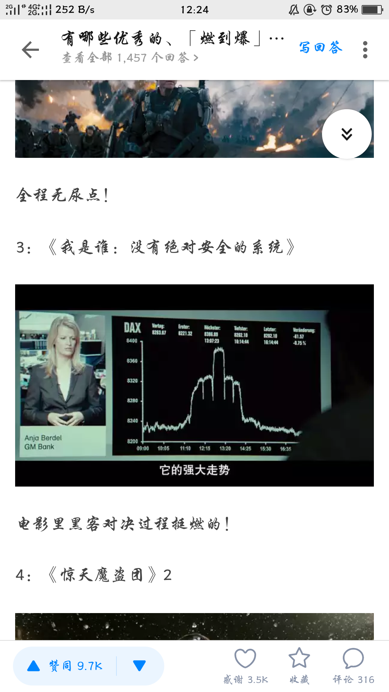

#  电影《我是谁：没有绝对安全的系统》观后感

## 观看详情

我观看这部电影是在`2019年9月13日星期五晚上9点50分`开始的，当时单纯只是无聊，因为刚好也是中秋节，懒得写微信推送了，打算找一部电影看看。在知乎上搜寻有什么好看的电影的时候，看到有一个回答

这里贴上知乎上回答的链接：[有哪些优秀的、「燃到爆」的电影？](https://www.zhihu.com/question/48035752/answer/119127273?utm_source=qq&utm_medium=social&utm_oi=906051927735963648&hb_wx_block=1)

电影时长`100分钟`，看到弹幕上有人说删减了，但好像也差不多，就没太在意。看完之后已经晚上11点半了，本打算看个电影休闲，结果看完反而贼激动。然后就有了写一篇博客关于这部电影读后感的想法，但是由于懒，是的，懒，拖到了3天后的今天。

## 剧情简介

> 本杰明是一个这样的人：三次元现实世界中，他是一个十足的屌丝&Loser，难以找到存在感，没有时尚感、没有朋友，也没有女朋友。但是二十五岁的他却是一个的电脑极客，拥有对数字技术不可思议的天赋。而影片中另一位主人公马克思是一个渴望“黑客世界”的潜在革命者，他注意到了本杰明在 网络方面的惊人才华，马克思、本杰明和神童斯蒂芬以及保罗私人组建了黑客组织CLAY，并且为了正义入侵国际安全系统。他们凭借高超黑客技术的所为引起了德国秘密警察组织、欧洲刑警组织的重视，并且一个邪恶的黑客将他们视作威胁，想要将他们除去。本杰明因此感觉到自己正在面临生死攸关的考验，并且他们的目标似乎不值得他付出如此大的代价……

## 电影类型

- 导演: [巴伦·博·欧达尔](https://movie.douban.com/celebrity/1255947/)
- 编剧: [巴伦·博·欧达尔](https://movie.douban.com/celebrity/1255947/) / [扬特耶·弗里泽](https://movie.douban.com/celebrity/1350163/)
- 主演: [汤姆·希林](https://movie.douban.com/celebrity/1005071/) / [埃利亚斯·穆巴里克](https://movie.douban.com/celebrity/1018334/) / [沃坦·维尔克·默林](https://movie.douban.com/celebrity/1130970/) / [汉娜·赫茨施普龙](https://movie.douban.com/celebrity/1050127/) / [崔娜·蒂虹](https://movie.douban.com/celebrity/1000809/) 
- 类型: 悬疑 / 惊悚 / 犯罪
- 官方网站: [www.whoami-film.de/site/](http://www.whoami-film.de/site/)
- 制片国家/地区: 德国
- 语言: 德语 / 英语
- 上映日期: 2014-09-25(德国)
- 片长: 102分钟
- 又名: Who Am I - No System Is Safe / WhoAmI
- IMDb链接: [tt3042408](http://www.imdb.com/title/tt3042408)

## 豆瓣热评

> [茶芜此人](https://www.douban.com/people/Henry-Jean/)  2015-05-03 07:26:15
>
> ## [还是玩弄人心的伎俩——Social Engineering](https://movie.douban.com/review/7461768/)
>
> “没有一个系统是安全的”
>
>  “人不能总藏在他的计算机后面，最大的安全漏洞并不是存在于什么程序或者服务器内，人类才是最大的安全漏洞”
>
> “所有黑客手段中最有效的、最伟大的幻想艺术——社交工程学”
>
> “你的脸皮要足够厚，那样世界就会在你的脚下”
>
> 台词点明主题，这电影要表达的是黑客除了本职技术外，还需要回归到最传统的路子上，要会骗人。
>
> “人类天生胆小且容易受骗” “人们只看到他们愿意看到的”
>
> MRX用的招数是根据对方给自己设的陷阱反过来给对方设置陷阱，男主角学得很快，利用MRX的性格弱点使他落网，利用女调查员的弱点让自己和同伙逃脱，用剧中台词就是“黑掉人类”——每个人也就是更精密但一样有安全漏洞的电脑系统。

> [格列柯南](https://www.douban.com/people/chincir/)  2015-05-10 09:43:17
>
> ## [没有绝对信赖的人性](https://movie.douban.com/review/7468573/)
>
> 德国电影处处透着我是谁，我为什么活着，我死了怎么样的哲学问题。你原本以为讲述网络黑客的电影，偏偏翻转成“社会工程学”；原本以为是人格分裂症，最后却还是人性——人们只想要看到他所希望看到的。
> 没有绝对安全的系统，实际上也是没有绝对值得信赖的人性。

> [陈力要给力了啊](https://www.douban.com/people/127667572/)  2015-05-16 13:53:07
>
> ## [这部剧并不像他们说的那样有很多BUG](https://movie.douban.com/review/7473989/)
>
> 看了几篇长评，无非是两种，一种就是夸这部剧的反转很吸引人，再有一种就是分析帝各种分析BUG。
> 我在看完整部剧下来，似乎觉得并没有什么BUG，就在今天早晨蹲厕所的时候，我突然想到了，主角只是一个心理障碍的loser，他不会有蒙混过心理医生的能力，其实本剧结局有个更容易让人接受的说法，“人们总是愿意相信自己看到的”，那么这句话同样适合坐在电脑前面的观众，最后你看到主角的teammate都活着，其实真是这样吗，他们依然是主角的人格分裂，对于一个孤僻的天才，他在被放走了以后，自己却为自己编出了另外一个与现实相悖的剧情，这才是真正的人格分裂的电影，编剧是很厉害的，他不是骗过了女警察，而是骗过了这么多观众，大家都是只愿意相信自己看到的，主角其实就是因为得了病，被女警察同情了，放了出去，但这样一个天才，就如同影片开头一直说的，主角想成为超级英雄，他一直想把自己当作超级英雄，于是，他被以一个loser的身份放出去以后，他并不能接受这样的事实，他在另一个空间为写出了另外一种故事，这个故事里他成了聪明绝顶的天才，而这个空间就是主角人格分裂的大脑！
> 这只是我对这部影片的理解，我只是觉得这样的理解会让影片显得更有预谋，因为编剧想骗过的就是观众。如果有不同理解的网友，不要喷。有共鸣的网友，给个赞。

> [第22条军规](https://www.douban.com/people/xiaomin85/)  2015-06-30 09:34:53
>
> ## [黑客高境界](https://movie.douban.com/review/7514180/)
>
> 前几天QQ有人加我，问我贴吧账号还用吗？不用的话，她用一个新ID跟我交换。我很奇怪她居然这样问话，于是礼貌性地回答百度账号和许多其它账号绑定的，所以还是不必了。然后她告诉我她知道我贴吧的密码。我有些警觉，问她知道我的ID是什么吗？她说，这几天她买到一个社工软件，有我账号和密码的信息。
>
> 我在网上查了一下，果然在许多社工网站上可以查到我泄露的密码和曾经加入的QQ群信息。虽然在乌云爆出类似巨大漏洞时，我及时更改了密码，但想起来不免有些后怕。在互联网时代，似乎每个网民都没有什么秘密可言。信息，对于MRX这样的黑客而言，只是信手拈来的东西。泄露，也是迟早的事。
>
> 这部电影属于看起来让你心潮澎湃，看完回味也就那么点东西的类型。
>
> 黑客大神MRX，FR13ENDS，CLAY。现实社会中的卢瑟，在戴着面具的网络世界横行无阻。伴随Macbook黑白屏幕以@root开头的命令行，一串串代码不停地print，整个网络世界如同待拆的包装品。敢做就敢赢，没有一个系统是安全的。而人就是整个系统中最大的漏洞。
>
> 由此故事将主题升华到黑客的至高境界：社会工程学。
>
> 社工学本质在于欺骗，精髓在于让被骗者在经过思考之后陷入设计好的圈套。假设被骗者是有智慧和思想的，而他们的智慧和思想却总是在你的掌控之内。
>
> 卢瑟whoami在现实中是个送披萨的，不善交际，在人群中也不起眼。不过偏执的whoami热衷电脑技术，擅长寻找系统中漏洞进行攻击。whoami为喜欢的女神v黑进了大学的服务器，窃取到考试题目，小试牛刀，但仍然没有获取女神的芳心。
>
> 在进行社会公益劳动时，whoami认识了同样热爱电脑技术的马克斯。马克斯热情开朗，夸夸其谈，虽然只懂得复制+粘贴，但前期他成功地将自己包装成一个同样热爱技术的Geek，并将whoami及另外两位软硬奇才笼络在一起，组建黑客团体：CLAY。
>
> CLAY在网络世界攻城略地。
>
> CLAY虽然取得越来越大的成就，但黑客界神的存在MRX对CLAY的成就嗤之以鼻。在记者询问MRX对CLAY的看法时，MRX反问：CLAY是谁？
>
> 天生骄傲的马克斯被彻底激怒，他决定带领CLAY完成一项举世瞩目的攻击：袭击德国情报局。
>
> whoami找到德国情报局的漏洞，以@root敲击几行代码，窃取到服务器数据。whoami把这段数据发给MRX（证明自己多厉害）。MRX将数据出卖给俄国网络黑帮，俄国网络黑帮根据德国情报局的这份数据得知黑客Krypton原来是替政府卖命的。俄国黑帮杀死了Krypton。
>
> 引上杀身之祸的CLAY如梦方醒，一个个大呼小叫怎么办？
>
> 只有找出MRX的真身，CLAY才能摆脱干系。可是黑客大神MRX岂是那么容易上当的。whoami决定放大招：攻击欧洲国际刑警组织，窃取数据，在数据中嵌入木马后转送给MRX。
>
> CLAY再次攻破国际刑警组织数据库，成功窃取到数据。在将数据交给MRX的那一刻，MRX识破CLAY的阴谋，当场破坏数据，发现隐藏其中的木马。CLAY的这次网络攻击也让他们成为欧洲刑警组织的通缉犯。女干警汉娜顺利抓获whoami。
>
> whoami在审讯室复述CLAY犯罪整个过程，协助汉娜通过木马找到MRX——一个19岁的天才少年，并将之缉拿归案。whoami的复述让S隐约感觉到whoami是个多重人格患者，CLAY团队其实只有他一个人，其他人都是出自whoami的想象！
>
> 通过调查汉娜更加确信自己的想法。
>
> 证人保护计划是无法保护到精神病患者的。出于道义和极高的责任感，汉娜对whoami网开一面，授权他进入欧洲刑警证人保护数据库修改，列入证人保护名单。
>
> 这就是人的BUG。社工学。
>
> 最后whoami和他CLAY的伙伴们又在一起愉快地玩耍。
>
> 电影在处理黑客之间的交流比较有意思。比如戴面具的黑客，藏在木马中的木马和敲碎小黑屋的铁锤。

[点击此处查看更多热评](https://movie.douban.com/subject/25932086/reviews)

## 我的感悟

刚才看了一下豆瓣上一些大神的热评，其实就有点不想写了。被他们说的，一点写的欲望都没有了，但还是坚持着，写吧。这是第一篇读后感博客，得开个好头才行，虽然文采肯定不咋地，慢慢学嘛。

整体上我的感觉是有些惊艳了，`局中局`的玩法的确把我玩得一愣一愣的。本来也就是抱着休闲的态度去看电影的，哪有打算过分的去纠结什么细节。

整部电影以半倒叙的方式叙述，刚开始叙述的画面，其实并没有让给我太过于注意，毕竟电影都是这个套路，开头总是为了吸引观众而透露一些后面的场景。其中就包括了一个**方糖掉入咖啡**的画面。

其实直到看了热评我才想起来这个画面，于是重新找了电影开头截了个屏。

该片主要讲述了一个普通人（班杰明）立志成为世界英雄从而发掘自己的计算机天赋成为黑客与知名黑客搏斗的事情。看完的时候我才真的是觉得，能力强大真的可以为所欲为。当马克斯让班杰明秀一手的时候，**几行代码就让整条街道里的电源断电**，可谓是炫酷到我了。

在班杰明加入马克斯的团队后，创立了他们自己的team，名字叫做`Clay`，clowns laughing at you的缩写。由于马克斯当时崇拜的偶像是黑客界著名的`MRX`，一心想引起`MRX`的注意，于是“攻击”各种机构。当电视台都已经放出Clay的名声之后，`MRX`却丝毫不为所动，甚至反问`Clay是谁`。

该举动马克斯很是生气，最后团队成员决定入侵当时德国最严谨的机构（**德国情报局**），虽然很困难，但是为了引起`MRX`的注意，团队也是拼了。在最后终于通过各种巧合，进入了那个啥子机构，然后成功的将所有的打印机修改了，打印出来的内容是`Clay`的宣传单（还挺好看的样子）。

原本他们只是打算控制该机构的打印机，并不打算获取数据之类的，然而此时电影主人公班杰明留了一个心眼，获取了该机构内部的一个重要名单，但是他并没有跟团队内部的其他成员说起这件事。随后，在他们庆祝入侵完美结束的时候，马克斯似乎泡了班杰明的明恋女神，导致班杰明十分生气，与马克斯吵了起来。在吵架的过程中，马克斯说了一句气话**”没有我们，你什么都不是！“**，于是班杰明一气之下，将在机构获取的名单发给了`MRX`。

谁曾想，名单里面含有了政府卧底的名单，而`MRX`发现了其中一个卧底就在自己身边，于是，将该卧底杀害，最终甩锅给了`Clay`。于是，Clay玩火玩过头了，变成了全民通缉的对象，无论黑道白道，都在搜寻Clay的真实身份。但其实真正的凶手是`Clay`，`Clay`决定放大招：攻击欧洲国际刑警组织，窃取数据，在数据中嵌入木马后转送给`MRX`。此处描述得十分形象，**恐龙肚子里的恐龙**。在将数据交给`MRX`的那一刻，`MRX`识破`CLAY`的阴谋，当场破坏数据，发现隐藏其中的木马。`CLAY`的这次网络攻击也让他们成为欧洲刑警组织的通缉犯。女干警汉娜顺利抓获班杰明。此时场景与开篇时的场景相呼应，本以为影片的剧情到这里也就进入末端，结果正是高潮之时。

班杰明在审讯室复述`CLAY`犯罪整个过程，协助汉娜通过木马找到`MRX`——一个19岁的天才少年，并将之缉拿归案。班杰明的复述让汉娜隐约感觉到班杰明是个多重人格患者，**<u>CLAY团队其实只有他一个人，其他人都是出自班杰明的想象</u>**！此处神转折成功让我惊呼刺激，但少许之后也逐渐淡然。毕竟很多电影都是这个套路，因此对我的感触在这里并不是很大。

通过调查汉娜更加确信自己的想法。证人保护计划是无法保护到精神病患者的。出于道义和极高的责任感，汉娜对班杰明网开一面，授权他进入欧洲刑警证人保护数据库修改，列入证人保护名单。

在影片的最后，汉娜将班杰明送走，最后在车上，询问了班杰明魔术是如何变的。**<u>四块方糖如何变成了一块，又再次从一块变成了四块</u>**。班杰明下车后，镜头拉向了汉娜，汉娜的笑容逐渐凝固，此时响起了背景音乐。影片的最后，在一艘轮船上，Clay的四名成员加上班杰明的女神，同时出现，意料之外，却又在情理之中！影片也走向了结束……

虽然影片并没有直接指明，但我想，这应该算是对整个影片的一个呼应。影片由方糖魔术引入，最终由方糖魔术结束。魔术的表演正好体现了电影的主线，由四个人变成一个人，再到最后的四个人，局中局的剧情让人直呼刺激。因此本人觉得，该部电影整体给人的体验还是很不错的。具体细节也没有深究，什么社会工程学也没有太关注。电影嘛，休闲一下就好。

写于2019年9月16日 14时12分

