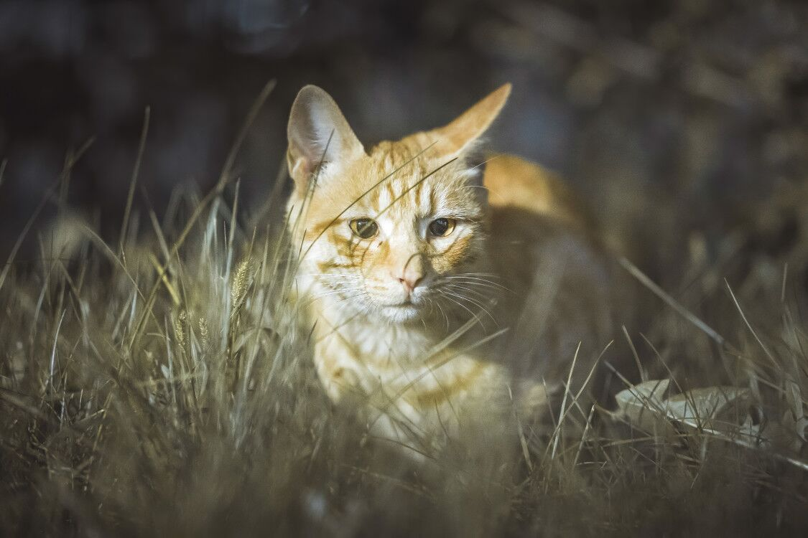

# 风乍起，合当奋意向人生

天上烟火四绽，地上却格外寂寥，百米内不见人影。一片昏暗中，草丛里传出窸窸窣窣的声响，定睛细看，原来是只野猫。

---

2021年已经来临，一月转眼也就过去了。新的一年来临，发生了很多事情，曾让我误以为今年的我要转运了。兴许是兴奋过了头，当吵闹与物品摔碎的声音从隔壁房间透过房门扑了过来之时，仍有些恍惚，随而惊醒，并非错觉，而是真实发生了。

2020年印象最为深刻的一句话便是：**偏见，是根深蒂固刻在骨子里的**。也许正因如此，脑子里时不时的都会回想起这句话，如同骆驼反刍一般，时刻用这句话警醒着自己。

我一直认为，人生观是不断在变化的，因为周围遇到的人也在改变，价值观、人生观的取向会受到周围人潜移默化的影响。所以以前的我以为，只要我不断向上爬，遇到越来越多的人，学习各种行为，终究有一天，我会将身上一些尚未察觉的陋习全部改掉。甚至当我看到社会心理学著名实验——[斯坦福监狱实验](https://baike.baidu.com/item/%E6%96%AF%E5%9D%A6%E7%A6%8F%E7%9B%91%E7%8B%B1%E5%AE%9E%E9%AA%8C/20188120?fr=aladdin)之时，我更加肯定了自己的观点。

然而，当我逐渐溯源自己行为的时候，我不得不开始承认，**有些事情，是很难改变的。也许如同偏见一般，是根深蒂固刻在骨子里的。**当发现自己敏感自私多疑妒忌偏执狂暴都逐渐的能在身边的环境中找到源头之时，或多或少有些挫败感。而这些情感，似乎早已融于血水之中，迸发已成为了一种习惯，但这种根深蒂固的习惯，又是额外的难改。所以发现这一点时，多少有些崩溃。

难改归难改，只要咬牙坚持一下，也总能改过来。可是，发现脑海里过往记忆的片段愈见模糊，便有些迷茫与不知所措。后来才得知，**失去过去的部分记忆，也可能是一种自身的防御机制**。人体会透过忘却来保护自己，避免想起痛苦的往事。如此想来，从小自身的防御机制就非常奇妙，许多行为压根就说不清楚原因，但现在再往回想时却发现，这竟然是那种处境下最好的处理办法了。尽管不知道在害怕什么，但内心深处总有一个声音在告诉自己，要赶紧逃离。

其实，之前自己压根就不知道要逃离什么。但是当争吵与物品摔碎的声音透过房门传来之时，身体不知觉地颤栗，突然就想起了因防御机制而尘封起来的一年前的记忆。脑海深处的记忆被唤醒后，脑子里突然就如同连锁反应一般，将隐藏起来的类似的片段全部激发。不同时段却有着相似场景的画面一帧帧从脑海里闪过，头眼昏花，两腿发软，竟有些无助感。

似乎与年龄无关，即使是临近半百，貌似也会冲动行事。而人在冲动之时，总爱寻找方式去释放压力，有人选择睡觉，有人选择宣泄，有人选择摔东西。孰是孰非，一下子也分辨不清。可是即使如此，我仍觉得，***情绪管理应当是人生中非常重要的一门必修课***。因此当情绪失控，甚至不分青红皂白地使用最狠的言语去中伤无辜人的情况发生在“知天命”的年龄时，让我产生了些许不满。

人们总说，不要去在意气话，气话不是真话。可是我总觉得，**那些翻旧账的气话，是因为往事从未被妥善处理**。而在我长久的观察发现中，这些从未被妥善处理的伤，终究会沦为两人感情中的裂痕。等到这些裂痕日积月累，两人的感情也就潜移默化地淡化了，甚至说不出一丝原因。

兴许是为了防止因一时冲动而犯下不可弥补的过错，亦或是为了阻止这场无意义的闹剧，昔日不懂事的少年却毅然决然地阻挡在门前，无论如何威胁，甚至扬言暴力，都无动于衷。说来也是可笑，平日里尽显冷漠的少年，竟在此刻以一丝责任感为由，而不惧天下事。

也许是想着将少年锁在门外，少年便会妥协。但谁曾想，少年竟固执地在门外守候。太阳早早地藏于大地，乌云迅速占领天空，夜幕降临了。天上烟火四绽，地上却格外寂寥，百米内不见人影。一片昏暗中，草丛里传出窸窸窣窣的声响，定睛细看，原来是只野猫。看着野猫被烟火声吓得四处逃窜之时，突然也就明白了自己一直以来，在逃离的是什么。